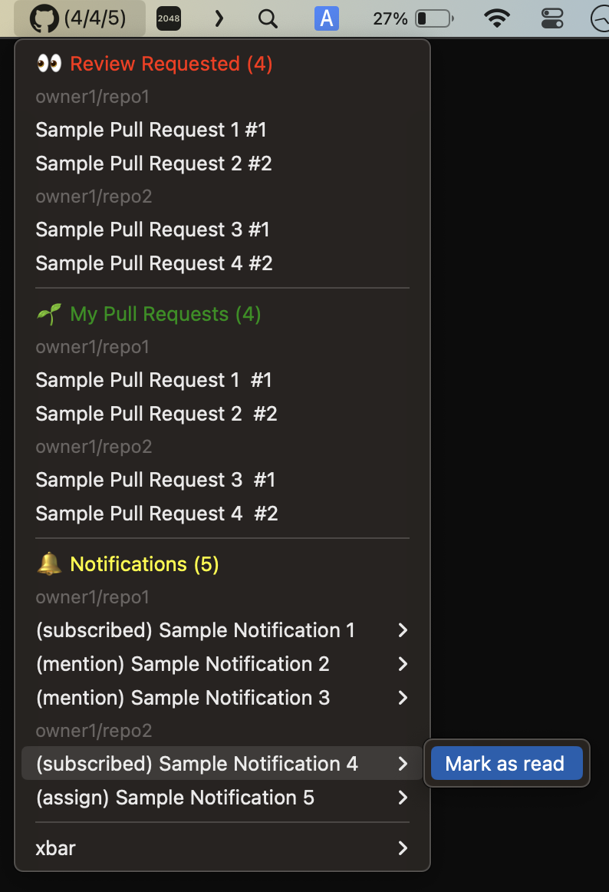

# xbar Plugin for GitHub

<p align="center">

</p>

## Prerequisites

`node` is required to be installed with Homebrew.

```console
$ brew install node
```

## Installation

### Clone repository

```console
$ git clone git@github.com:koki-develop/xbar-plugin-github
$ cd xbar-plugin-github
$ make
```

A symbolic link is created in `~/Library/Application Support/xbar/plugins/github.5m.js`.

### Install directly

```console
$ wget https://raw.githubusercontent.com/koki-develop/xbar-plugin-github/main/github.5m.js -P ~/Library/Application\ Support/xbar/plugins/
$ chmod +x ~/Library/Application\ Support/xbar/plugins/github.5m.js
```

## Configuration

- `GITHUB_TOKEN` : Your GitHub Personal Access Token.
- `SHOW_REVIEW_REQUESTED` : Show Pull Requests that are requested to review.
- `SHOW_MY_PULL_REQUESTS` : Show your Pull Requests.
- `SHOW_NOTIFICATIONS` : Show your notifications.
- `SHOW_PULL_REQUEST_STATUS` : Show Pull Request's status.
- `SHOW_PULL_REQUEST_BRANCHES` : Show Pull Request's base/head branches.
- `SHOW_NOTIFICATION_REASON` : Show notification's reason.
- `INCLUDE_BOT_PULL_REQUESTS` : Include Pull Requests created by bots.


## LICENSE

[MIT](./LICENSE)
