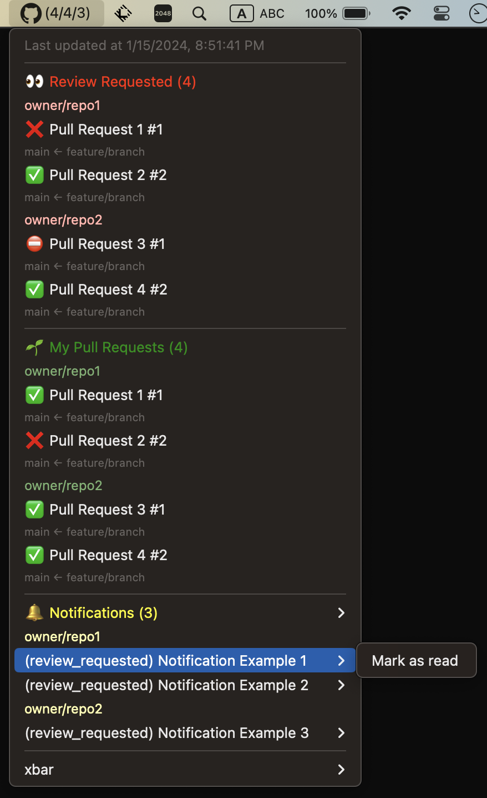

# xbar Plugin for GitHub



## Prerequisites

`node` is installed by homebrew.

```console
$ brew install node
```

## Installation

### Clone repository

```console
$ git clone git@github.com:koki-develop/xbar-plugin-github
$ cd xbar-plugin-github
$ make
```

A symbolic link is created in `~/Library/Application Support/xbar/plugins/github.5m.js`.

### Install directory

```console
$ wget https://raw.githubusercontent.com/koki-develop/xbar-plugin-github/main/github.5m.js -P ~/Library/Application\ Support/xbar/plugins/
```

## Configuration

- `GITHUB_TOKEN`: Your GitHub Personal Access Token.

## LICENSE

[MIT](./LICENSE)
